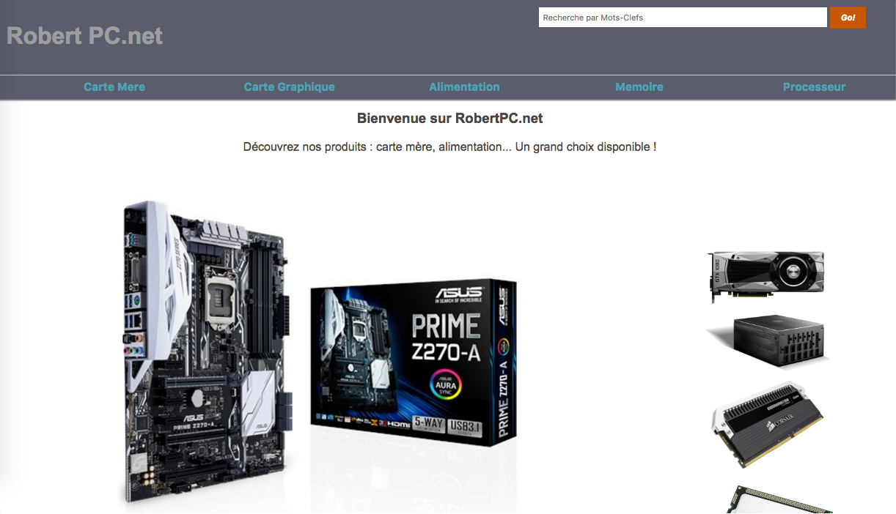
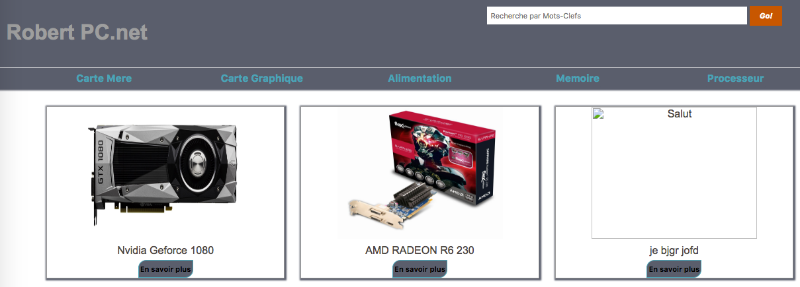

#Manuel d'utilisation

##Interface utilisateur
L'utilisatueur de notre site souhaite consulter des produits.
Tous nos produits sont classés par type.

 

En cliquant sur un élément du menu, l'utilisateur peut accéder à la liste des produits de thème (carte Mère, Carte Graphique..). il peut executer cette action depuis toutes les pages du sites.

***
 

Aprés avoir choisi une catégorie, l'utilisateur peut voir afficher la liste des produits de la catégorie. En cliquant sur le bouton "En savoir plus", il peut également avoir accés aux détails du produit.

***
 

L'utilisateur peut également effectuer une recherche par Mots-clés. Cette recherche affichera tous les produtis du site contenant ce produit, independamment des catégories. Il peut ensuite afficher les détails d'un produit.

